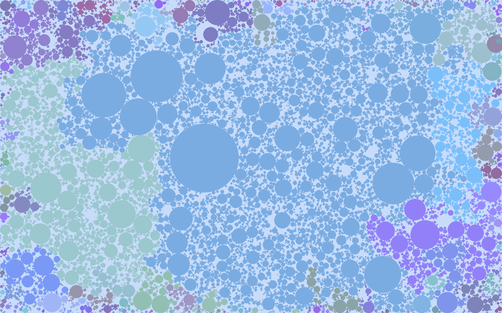
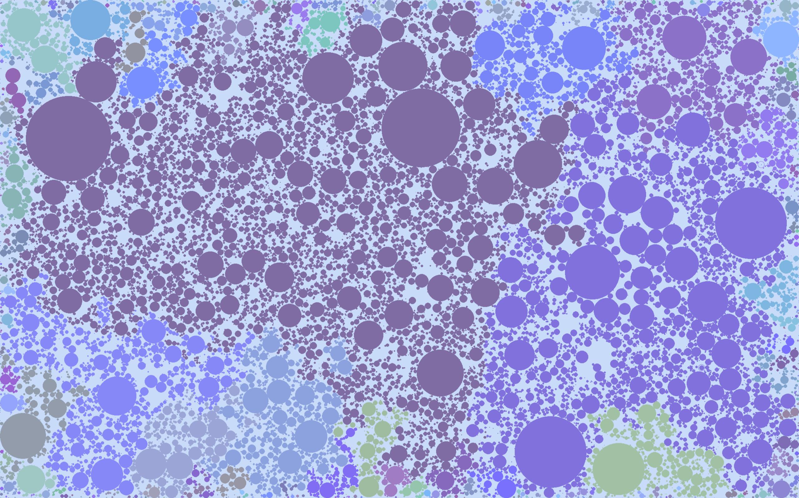

A simple visualization inspired by Android 12 easteregg.

It could be a nice screensaver, but it's not.

Dots appear and disappear. They try to be as big as possible, so most of the dots touch other dots or borders of the screen. The color is a nice pastel, but dot inherits the color of the dot it touches.

It reminds me of a civilization simulation, where the dots are emerging and disappearing tribes and color signifies the tribe's loyalty.

It handles around 20k dots and there is large room for optimization.

You can pause and restart the simulation by pressing `p` and `r` respectively. You can create and remove dots using mouse (left click drag & right click).




## Instructions

```bash
# install pygame and then simply
python3 touching_circles.py
```